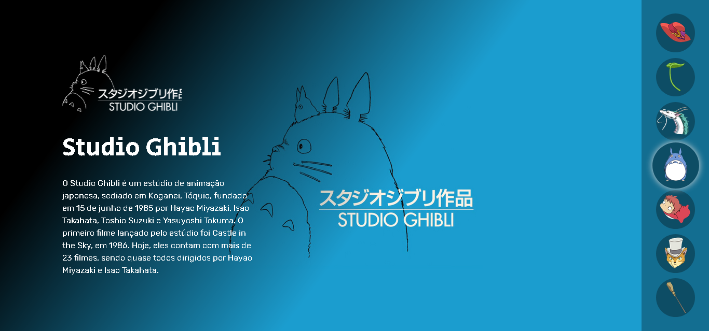
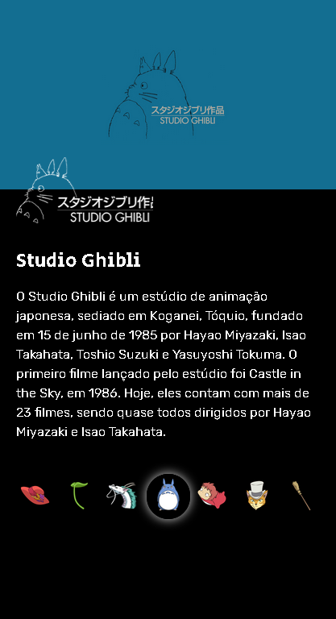

# STUDIO GHIBLI

Esse projeto permite a visualização de alguns dos filmes que fazem parte da Studio Ghibli, com a sinopse de cada um. É um projeto personalizado que desenvolvi durante a Semana do Zero evento do Dev em Dobro, que originalmente fez sobre os personagens do anime One Piece.

## Projeto

- [Clique aqui para acessar o projeto](https://cnkelvin.github.io/studio-ghibli/)

## Tecnologias

Esse projeto foi desenvolvido com as seguintes tecnologias:

- HTML
- CSS
- JavaScript

## Layout Web

## Layout Responsivo

